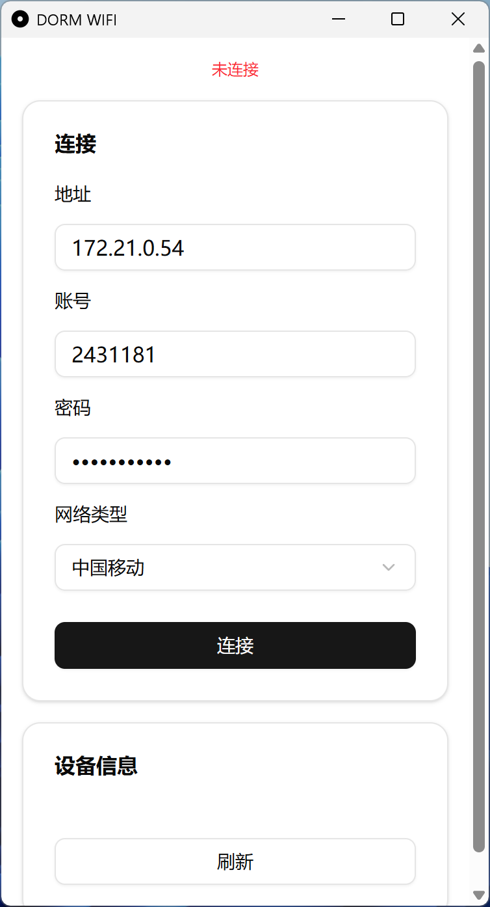
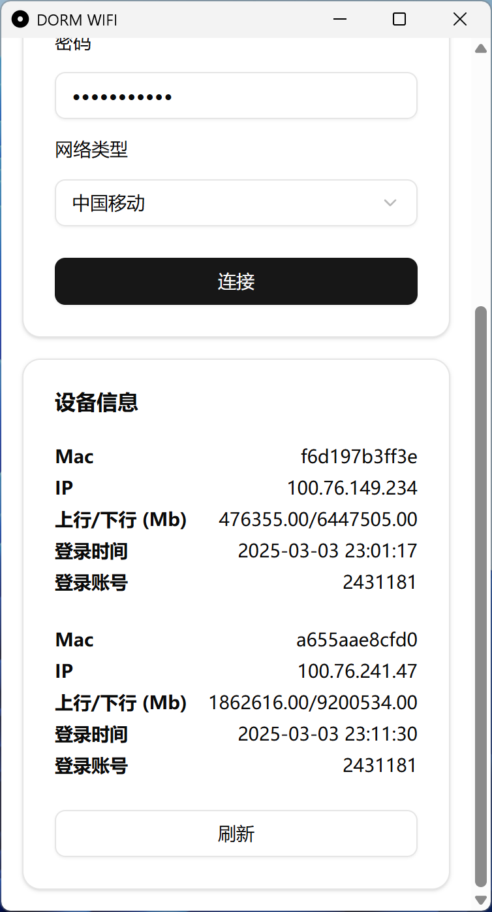

# DORM WIFI

- `TJ-DORM-WIFI` connector based on Tauri.

- Test on [Tianjiao Apartment](https://news.tongji.edu.cn/info/1002/88212.htm).

- **Download links**

    - macOS - Intel (Build from source) | [Apple Silicon](https://github.com/sitdownkevin/dorm-wifi-tauri/releases/download/v1.0.0/DORM.WIFI_0.1.0_aarch64.dmg)

    - Windows - [Intel/AMD](https://github.com/sitdownkevin/dorm-wifi-tauri/releases/download/v1.0.0/DORM.WIFI_0.1.0_x64-setup.exe)

## Features

### (Dis)connect to `TJ-DORM-WIFI`



### Get device information by account

Query all device information under the current account



## Dev

```shell
yarn
```

```shell
yarn tauri dev
```

## Build

```shell
yarn tauri build
```